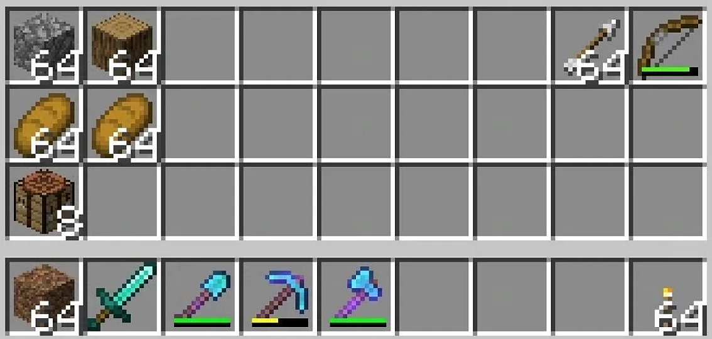

<h1 align="center">🧱⛏ Mine Grid Inventory ⛏🧱</h1>

The goal of this project is to develop an inventory simulator in .NET / Blazor Server for a famous game with blocks and mining.

    

## ✔️ Features

These features will be available in the future, when the project will be completely finished, so stay tuned to be notified when there will be available !

* Visualization of a "grid" type inventory page in which it is possible to visualize different objects.
* The project consists of two parts: the inventory grid and the inventory of available items
* Display of inventory items, names, images, descriptions, stock, enchantments, repair materials...
* Filtering, searching and paging the stock.
* Responsive site, colorful, pleasant to use, accessible (English / French translations, preview of the text,...).
* Recording user actions (log messages...).
* The grid contains the elements (objects) or empty boxes depending on the location and the availability of the objects.
* Addition of objects via drag and drop from stock to inventory with management of maximum object stacking sizes.
* Save drop position, manage locations and maximum sizes in configuration files.
* Removal of items via drag and drop outside the window, splitting/reducing stacks of items.

## 🖥️ Langages and technologies used

- C# ([API reference](https://learn.microsoft.com/en-US/dotnet/csharp/))
- Blazor Server ([API reference](https://learn.microsoft.com/en-US/aspnet/core/blazor/))
- ASP .NET & API development ([API reference](https://learn.microsoft.com/en-US/aspnet/core/))

## 🧵 Prerequisities

- [Visual Studio](https://visualstudio.microsoft.com/en/)

## ⚙️ How to run the app ?

* Start Visual Studio.
* Open the solution in `src/` named `Blazor_PerretTremblay`.
* Run the project inside Visual Studio and enjoy!

## 📌 Documentation & developper guidance

You can find more information about the technical choices, conception and some sketches in the [Wiki](https://codefirst.iut.uca.fr/git/louis.perret/Blazor_PerretTremblay/wiki) of this project.

Also, look at the `doc` folder at the root of this repository!

## 👤 Authors

**Jérémy TREMBLAY**

* Github: [@JeremyTremblay2](https://github.com/JeremyTremblay2)
* LinkedIn: [@Jérémy Tremblay](https://fr.linkedin.com/in/j%C3%A9r%C3%A9my-tremblay2)

**Louis PERRET**

* [@Louis Perret](https://github.com/louis-perret)
* LinkedIn: [@Louis Perret](https://fr.linkedin.com/in/louis-perret-a67a6321b)

## 📝 License

We want to leave the possibility to other people to work on this project, to improve it and to make it grow, that's why we decided to place it under MIT license.

> Read more about the [MIT licence](https://opensource.org/licenses/MIT).