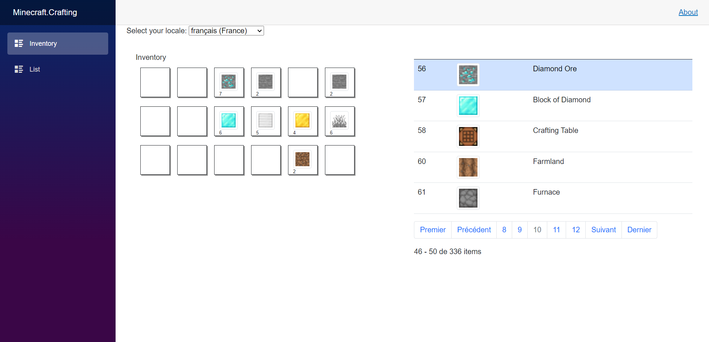
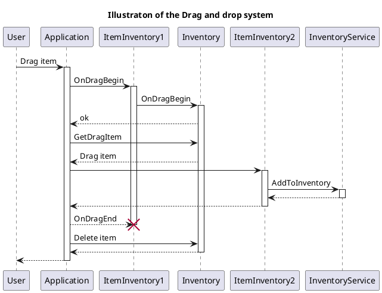

<h1 align="center">🧱⛏ Technical documentation of Mine Grid Inventory ⛏🧱</h1>

## Visual of the app

Here you can a screen of the final application: 

    

## How to use it ?

This application consists of three main pages. The first is simply a home page and the list page allows you to view the list of Minecraft items, add and edit them.
The inventory page is the most interesting because you can manage an inventory like in a real video game. It is possible for you, in the form of drag and drop, to select items from the list and move them into the boxes of your inventory. It then becomes possible to move items between inventory boxes only if they are of the same type. It is possible to remove items by dragging them off the screen and items can be stacked, their quantity will then be adjusted as needed.
Don't forget that you can change the language of the site at any time to have different translations according to your needs! Have fun !

## Structuration

This project consists of two distinct parts.

- [X] `Minecraft.Crafting`
- [X] `Minecraft.Crafting.Api`

The first part is the very essence of the application since it is the project itself containing the web application for managing an inventory system.
The second represents the API which is used by the first project, and allows to communicate with a server but especially to persist the data of the application. This allows you to have a remote backup of your data and you can then imagine a more advanced system in the future with various user profiles (for the moment only an inventory for a given person is used).

## Global Architecture

This app is made in C#/Blazor and uses HTML, CSS styling and JS animations for the front end. The pages use Razor components to structure and format the display, and the code is broken down into classes and multiple packages. 

    

Internally, the application uses a route system to manage navigation and displays data using and calling services. These services are of two kinds, it is either a local service which uses a LocalStorage to save in the browser (client side) the data that it has manipulated, modified, etc. This data is volatile and when the browser is restarted it will be lost, but it is still a form of persistence. The second way to save data is to use an API which communicates with the client and saves data, modifications, etc on the server side. The pages are therefore composed of Razor components which themselves use various technologies to format the display. The back-end handles the management of objects, inventory and drives the display and drag and drop via services that are responsible for ensuring data persistence.

In the end, even if this project looks rather simplistic, it still has a rather complete architecture allowing you to see how to structure an advanced web application.

## Description of te working system of the "drag and drop" function

Here is a sequence diagram representing the logic used in our application to manage the drag and drop system between inventory items. 

When a user grabs an object an OnDragBegin event is raised and he can then move it in the interface and it is retrieved by the inventory. At this time, the object is then created in the application and added to the inventory via the service used (which we recall can be an API or quite simply a LocalStorage). When the user releases the object (to place it in an inventory slot for example), the object held in the application is destroyed and is deleted from the inventory if it is a move between inventory box. Obviously this diagram remains simplistic and it turns out that it has many conditions and cases which do not appear here because we wanted to keep it readable.

# How to contribute ?

Look at the issue tab to see if there are any other issue to do, you can contribute to this project if you want!

